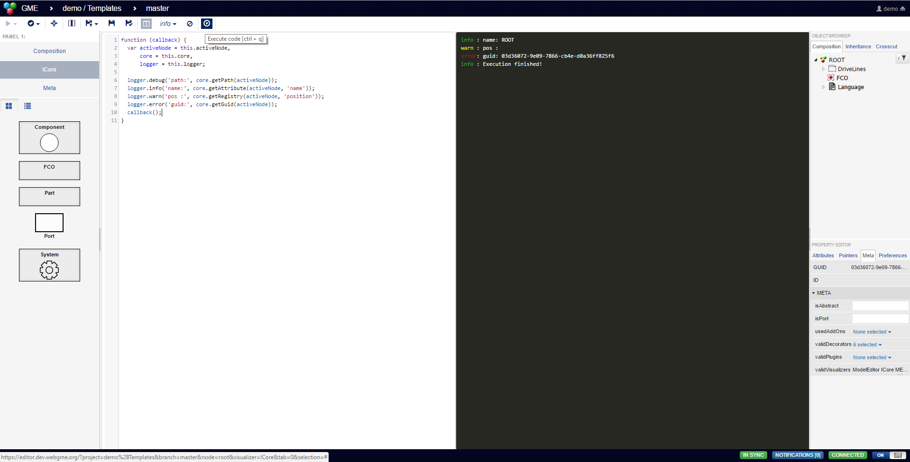
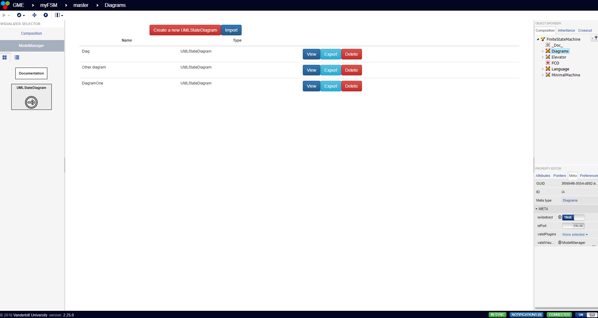

# UI-Components
A collection of domain independent webgme components. To use these make sure that you have installed [webgme-cli](https://github.com/webgme/webgme-cli) and that your repository was initialized with `webgme init`.

### Visualizers
#### ICore
Code-editor for interacting with models uses the same APIs available from a plugin (context is the main function of a plugin).
Note that this visualizer uses `eval` to evaluate the code and is recommended to only be used at dev-deployments.

- Import using the webgme-cli tool `webgme import viz ICore webgme/ui-components`
- Register visualizer at nodes where it should be available.
- If `scriptCode` attribute is defined the code can be saved back to model.
- See [ICoreDefaultConfig](src/visualizers/panels/ICore/ICoreDefaultConfig.json) for options.



#### ModelManager
Configurable, domain-specific, easy-to-use model management visualizer. It allows the creation, deletion
and import/export of models.

- Import using the webgme-cli tool `webgme import viz ModelManager webgme/ui-components`
- Register visualizer at nodes where it should be available.
- Modify and add the following to your [component-settings](https://github.com/webgme/webgme/wiki/Component-Settings).

```
{...
    "ModelManager":
    {
        "container": "pathOfTheContainer", 
        /* the listed models will be the children of this 
        node and new ones will be created here */
        "types": ['componentName','otherComponentName']
        /* these needs to be valid meta node names that will be
        the base of the new Models */
    }
...}
``` 


### Decorators
#### DisplayMetaDecorator
Inherits the functionality of ModelDecorator but also displays the meta-type of the object and ports.

- Import using the webgme-cli tool `webgme import decorator DisplayMetaDecorator webgme/ui-components`
- At root-node add to `validDecorators` under meta in property editor.
- At nodes where it should be used select it in `decorator` under preferences in property editor.

 compared with DisplayMetaDecorator (rhs) (hovering a port)")

### Plugins
#### ImportModels
Example plugin for using the ModelImport API but with custom matching of bases. The [Import Models Plugin](src/plugins/ImportModels/ImportModels.js) can be imported using webgme-cli, however it is meant to be used as a template for writing a similar plugin with own matching rules.

